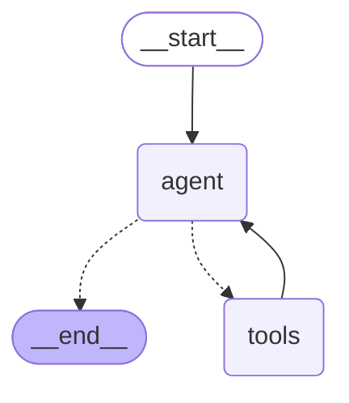

# TIL-RAG — 개인 학습 기록(TIL) 기반 RAG 질의응답 시스템

## Description

부트캠프 학습 과정에서 작성한 TIL(Today I Learned) 마크다운 문서를 지식 베이스로 삼아,
**순수 구현 → LangChain → LangGraph** 순서로 동일한 RAG 파이프라인을 세 번 재구축하며
각 프레임워크가 왜 필요한지, 무엇을 대체하는지를 직접 코드로 검증한 개인 학습 프로젝트입니다.

기존에 완성한 [`dev-docs-rag-agent`](https://github.com/KIMDONGWOOK12/dev-docs-rag-agent)(8주차 제출물)와
별개로, **AI 의존 없이 바닥부터 이해하고 다시 짜보기 위해** 자발적으로 시작했으며,
현재는 코드리뷰 도메인으로 확장(QLoRA 파인튜닝 + vLLM 서빙)까지 진행 중입니다.

---

## Roadmap Status

| Phase | 항목 | 내용 | 상태 |
|---|---|---|---|
| 0 | TIL 문서 작성 | 부트캠프 학습 기록 42개 마크다운 작성 | ✅ |
| 0 | 전처리 파이프라인 | 유니코드 정규화(NFC), 제어문자 제거, 공백 정리 | ✅ |
| 0 | Chunking | 고정 길이 분할 (chunk_size=500, overlap=50) | ✅ |
| 0 | 인덱싱 | Gemini 임베딩 + ChromaDB (299청크, `collection_name="til_rag"`) | ✅ |
| 1 | 순수 RAG 구현 | `retrieve()` / `generate()` 직접 구현 (`rag.py`) | ✅ |
| 1 | 프롬프트 설계 | 5원칙 (근거 문서만 사용 / 모르면 거절 / 출처 표시 / 3문장 제한) | ✅ |
| 1 | 환각 방지 검증 | 무관 질문(김치찌개 레시피) 시 "찾을 수 없음" 응답 확인 | ✅ |
| 1 | RAG 평가 | `evaluate.py` — 규칙 기반 vs LLM-as-Judge 비교 | ✅ |
| 2 | LangChain 마이그레이션 | 기존 Chroma 인덱스 재오픈 (재인덱싱 없이 전환) (`rag_lc.py`) | ✅ |
| 2 | 프롬프트 이식 | `ChatPromptTemplate` system/human 분리 | ✅ |
| 2 | LCEL 체인 조립 | `retriever \| format_docs`, `RunnablePassthrough` | ✅ |
| 2 | 동일 동작 검증 | rag.py 대비 동일 질문·동일 결과 확인 | ✅ |
| 3 | State/Node/Edge 설계 | `TypedDict` 기반 State, 조건부 라우팅 | ✅ |
| 3 | judge 노드 + 조건 분기 | LLM이 검색 필요 여부 판단 → `add_conditional_edges` | ✅ |
| 3 | 판단 근거 실증 | "오늘 너무 힘들고 피곤했다" 같은 일지성 문장에서 검색 생략 확인 | ✅ |
| 3 | ReAct Agent 확장 | `bind_tools` + `ToolNode` + `tools_condition` (`rag_graph.py`) | ✅ |
| 3 | Agent 자율판단 검증 | 지식 질문 → 도구 호출 / 잡담 → 도구 미호출 분기 확인 | ✅ |
| 4 | FastAPI 배포 | REST API 래핑 (`main.py`) — `/ask`, `/review`, `/docs/{filename}` | ✅ |
| 4 | 프론트엔드 | 단일 파일 채팅 UI, 출처 파일명 클릭 → 원본 문서 열람 | ✅ |
| 4 | 프론트엔드 개선 | TIL/코드리뷰 모드 토글, 카카오톡 스타일 UI, 대화 초기화 | ✅ |
| 5 | Qwen QLoRA Fine-Tuning | Colab GPU 환경에서 별도 진행 | ✅ |
| 5 | Post-Training Quantization | 양자화 전후 성능·메모리 비교 | ✅ |
| 5 | GGUF 변환 + Llama.cpp 추론 | Colab에서 별도 진행 | ✅ |
| 6 | Unix 프로세스·스레드·메모리 분석 | `ps` / `top` / `lsof` / `vmmap` 분석 보고서 | ✅ |
| 6 | Wireshark 통신 캡처 | loopback + 서로 다른 두 기기 간 HTTP 캡처 | ✅ |
| 7 | Docker 컨테이너화 | Dockerfile + Docker Compose | ✅ |
| 7 | AWS EC2 배포 | Docker Hub 경유, 외부 접근 가능 구성 | ✅ |
| 7 | GitHub Actions CI/CD | push 시 자동 빌드·배포 파이프라인 | ✅ |
| 8 | 코드리뷰 데이터 수집 | GitHub PR 리뷰 코멘트 1334개 (5개 저장소) | ✅ |
| 8 | 코드리뷰 QLoRA 학습 | v1(과적합) → v2 → v3(데이터 확충, 정확도 개선) | ✅ |
| 8 | vLLM 서빙 | OpenAI 호환 API, ngrok 외부 노출 | ✅ |
| 8 | RAG + vLLM 결합 | 유사도 threshold 필터로 무관 컨텍스트 차단 | ✅ |
| 8 | threshold 재조정 | 1334개 데이터 기준 재측정 | 🔄 진행 중 |

---

## Architecture

Agent 그래프 구조 (`rag_graph.py`):



- 실선(`-->`): 고정된 흐름
- 점선(`-.->`): `tools_condition`이 판단하는 조건부 분기
- `tools → agent`로 되돌아가는 **순환 구조**가 이 그래프를 Workflow가 아닌 Agent로 만드는 핵심

`retrieval`은 `tools` 노드 안의 `search_til` 도구에서 일어나며,
**agent가 필요하다고 판단할 때만** 실행됩니다.

---

## 검증 결과 요약

같은 두 질문을 3개 구현체에 동일하게 던져,
**로직 전환 과정에서 동작이 깨지지 않았는지** 확인했습니다.

| 질문 | rag.py (순수) | rag_lc.py (LangChain) | rag_graph.py (Workflow) | rag_graph.py (Agent) |
|---|---|---|---|---|
| "RAG가 뭐야?" | ✅ 문서 근거 답변 | ✅ 동일 | ✅ judge=True → 검색 후 답변 | ✅ 도구 호출 후 답변 |
| 무관 질문 (김치찌개 / 일지성 문장) | ✅ "찾을 수 없음" | ✅ 동일 | ✅ judge=False → 검색 생략 | ✅ 도구 미호출, 자연스런 응답 |

---

## Function

### Main
- TIL 문서 기반 질의응답 (검색 → 생성)
- 코드 리뷰 (RAG 검색 + 자체 파인튜닝 모델 생성)

### Sub
- 검색 필요 여부 자율 판단 (judge 노드 / Agent의 도구 선택)
- 문서 근거가 없을 시 환각 방지 응답
- 답변 시 근거 문서 파일명 인용, 클릭 시 원본 TIL 문서 열람
- TIL / 코드리뷰 모드 전환 UI
- 순수구현 / LangChain / LangGraph(Workflow) / LangGraph(Agent) 4단계 비교 구조 유지

---

## 설계 결정 & 근거

- **Chroma 컬렉션 재사용**: 인덱싱(299청크, 42분 소요)을 재실행하지 않기 위해,
  LangChain/LangGraph 전환 시 `Chroma(persist_directory=..., collection_name="til_rag")`로
  기존 인덱스를 재오픈.
- **judge는 규칙이 아닌 LLM 호출**: "오늘 너무 힘들고 피곤했다"처럼 키워드·물음표·길이 같은
  표면적 규칙으로는 검색 필요 여부를 판단할 수 없는 실제 사례를 확인 → 의미 기반 판단이 필요.
- **judge의 LLM 호출은 라우팅 함수가 아닌 노드 안에서 실행**: 라우팅 함수는 판단 결과만 읽어
  분기하고, 무거운 연산은 노드 안에서 처리하는 것이 LangGraph 권장 패턴.
- **judge+조건분기는 Workflow, bind_tools+ToolNode는 Agent**: 개발자가 실행 경로를 코드로
  고정했는지(Workflow), LLM이 실행 중 다음 행동을 스스로 선택하는지(Agent)로 구분.
- **출처를 문서 번호가 아닌 파일명으로 표시**: `format_docs()`에서 `doc.metadata['source']`를
  사용해 실제 파일명(`[26-06-17.md]`)을 노출 → 프론트엔드에서 클릭 가능한 링크로 변환.

---

## 확장 프로젝트 — 코드리뷰 QLoRA + vLLM 서빙 (`code_review/`)

TIL-RAG와 같은 RAG 구조를 **다른 도메인**에 적용하고,
**생성 모델까지 직접 학습**해본 확장 실습입니다.

| | TIL-RAG | 코드리뷰 |
|---|---|---|
| 도메인 | 개인 학습 기록(TIL 마크다운 42개) | GitHub PR 리뷰 코멘트 1334개 |
| 생성 모델 | Gemini API (비공개 가중치, 외부 서비스) | Qwen2.5-1.5B (공개 가중치) QLoRA 파인튜닝 → vLLM 서빙 |
| 검색 | ChromaDB (299청크) | ChromaDB (1334개) + 유사도 threshold 필터 |
| 전처리 | 청킹 (500자, overlap 50) | truncation (1000자 초과 시 절단) |

### 학습 이력

| 버전 | 데이터 | steps | loss | 결과 |
|---|---|---|---|---|
| v1 | 286 | 60 | 1.69 → 0.82 | 과적합 — 무관한 질문에도 학습 데이터를 그대로 재생 |
| v2 | 286 | 25 | 1.72 → 1.27 | 과적합 개선, 그러나 지시를 못 따르고 코드를 생성 |
| **v3** | **1334** | **100** | **2.44 → 1.28** | SQL 인젝션 코드에 파라미터 바인딩을 정확히 제안 |

### 데이터 출처

`langchain-ai/langgraph`, `langchain-ai/langchain`, `pallets/flask`,
`psf/requests`, `tiangolo/fastapi` — merge된 PR 500개씩의 `review_comments`

자세한 내용은 [`code_review/README.md`](code_review/README.md) 참고.

---

## Version

### Patch Version (0.x.N) — Development Stage
- 0.1.0: 순수 RAG 구현 — TIL 42개, 299청크 인덱싱, 환각 방지 검증
- 0.2.0: LangChain 마이그레이션 — LCEL 체인
- 0.3.0: LangGraph StateGraph — judge 노드 + 조건부 라우팅
- 0.3.1: LangGraph ReAct Agent — bind_tools + ToolNode
- 0.4.0: FastAPI + 프론트엔드
- 0.5.0: Docker + EC2 배포 + GitHub Actions CI/CD
- 0.6.0: 코드리뷰 QLoRA + vLLM 서빙 + RAG 결합 ← **now processing**

### Minor Version (0.N.x) — LLM Provider
- 0.0.x: Gemini API (`gemini-2.5-flash`, `gemini-embedding-001`) ← **now processing**

---

## 실행 방법

```bash
# 0. 인덱싱 (최초 1회, TIL 문서 → Chroma)
uv run indexing.py

# 1. 순수 RAG
uv run rag.py

# 2. RAG 평가 (규칙 기반 vs LLM-as-Judge)
uv run evaluate.py

# 3. LangChain 기반 RAG
uv run rag_lc.py

# 4. LangGraph ReAct Agent
uv run rag_graph.py

# 5. FastAPI 서버 (프론트엔드 포함)
uv run uvicorn main:app --host 0.0.0.0 --port 8000

# 6. Docker
docker compose up -d
```

코드리뷰 확장 프로젝트 실행은 [`code_review/README.md`](code_review/README.md) 참고.
(vLLM은 GPU가 필요해 Colab에서 실행하고, ngrok으로 노출된 주소를 로컬에서 호출합니다.)

### 배포된 서버

```
http://<EC2 퍼블릭 IP>:8000
```

EC2 인스턴스를 중지 후 재시작하면 퍼블릭 IP가 변경됩니다 (Elastic IP 미적용).

---

## Data Source

1. **개인 TIL 마크다운 42개** (til-rag)
   - 부트캠프 학습 기록 (Python, ML/DL, RAG, LangChain, LangGraph 등)
   - `til_notes/` → 전처리 후 299청크로 분할 → `chroma_db/`

2. **GitHub PR 리뷰 코멘트 1334개** (code_review)
   - 5개 오픈소스 저장소의 merge된 PR에서 GitHub API로 수집
   - `code_review/data/` → `code_review_db/`

---

## 앞으로의 계획

- 코드리뷰 threshold를 1334개 데이터 기준으로 재측정·재조정
- 더 다양한 언어·도메인 저장소를 추가해 데이터 편향 완화
- Elastic IP 적용으로 배포 주소 고정
- 자동화된 테스트 코드 작성 → CI 파이프라인에 test Job 추가